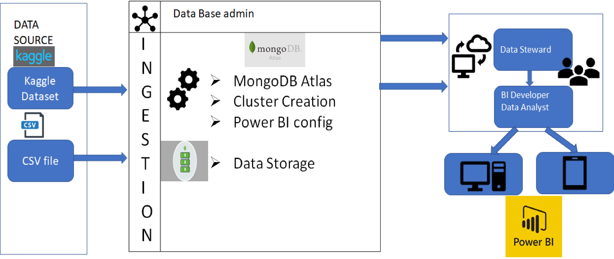
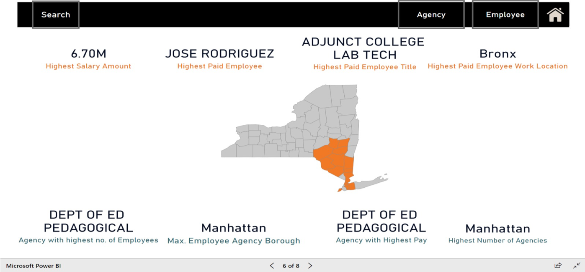
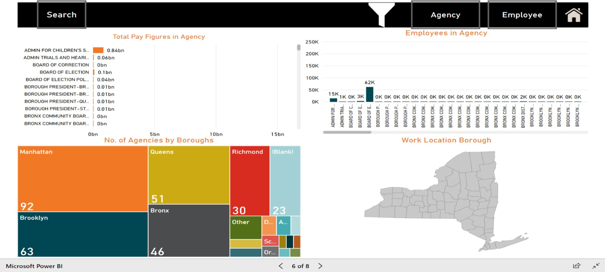
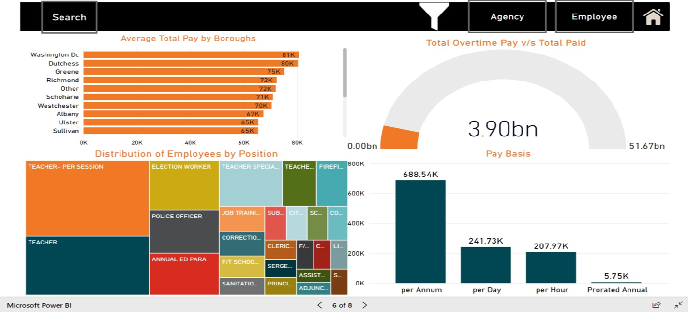

# New-York-Citywide-Payroll
## Data Visualization and Analysis

### Project Plan 
* Reading about the data from Kaggle
* Create a Data Dictionary 
* Comparison of NoSQL Database and selecting more suitable one
* Data Pre-processing
* Data Visualization and Documentation 


### Dataset: 

About: Citywide payroll data for New York City for the 2014, 2015, 2016, and 2017 fiscal years.
Content: This dataset provides columns for fiscal year, employee name, the city department they work for, their job title, and various fields describing their compensation. The most important of these fields is "Regular Gross Pay", which provides that employee's total compensation.
Context: This dataset contains the salary, pay rate, and total compensation of every New York City employee. In this dataset this information is provided for the 2014, 2015, 2016, and 2017 fiscal years, and provides a transparent lens into who gets paid how much and for what.
That means that this dataset contains, in its sum, compensation information for all City of New York employees for the period July 1, 2014 to June 30, 2017.


### Tools: 
```
1.PowerBI- Power BI is a business analytics service by Microsoft. 
It aims to provide interactive visualizations and business intelligence capabilities with an interface 
simple enough for end users to create their own reports and dashboards.
```
```
2.MongoDB Atlas- MongoDB is a cross-platform document-oriented database program. 
Classified as a NoSQL database program, MongoDB uses JSON-like documents with schemata. 
MongoDB Atlas is a fully automated cloud service that offers Database Solutions
```

### Vision Diagram: 


### Data Pre-processing: 
* Removed negative (-ve) values from the Salary columns 
* Changed the data types - i.e. String to Data, String to integer
* Added columns - Combined “First Name”, “Mid Init”, “Last Name”  to column “Name”
* “Regular Gross Paid”, “Total OT Paid”, “Total Other Pay” - “Total Pay” and then we created a hierarchy for the same. 
* Added key-value pair for New York map

### Visualization Overview: 



### Visualization - Number of Agencies vs Pay Ratio:



### Visualiztion - The big overtime conundrum



### Data Principles 
```
1. Understanding the data and its format. 
2. Ensuring Data quality standards and regulations.
3. Reduced operational friction
4. Data ownership and accountabilities for cross-functional data-related decisions,
processes, and controls.
5. Build standard, repeatable processes
6. Track the data changes made over a time period.
7. Transparency and documentation
```
